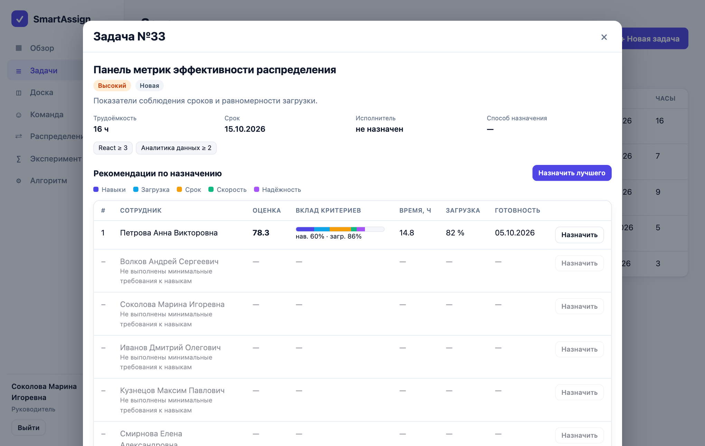
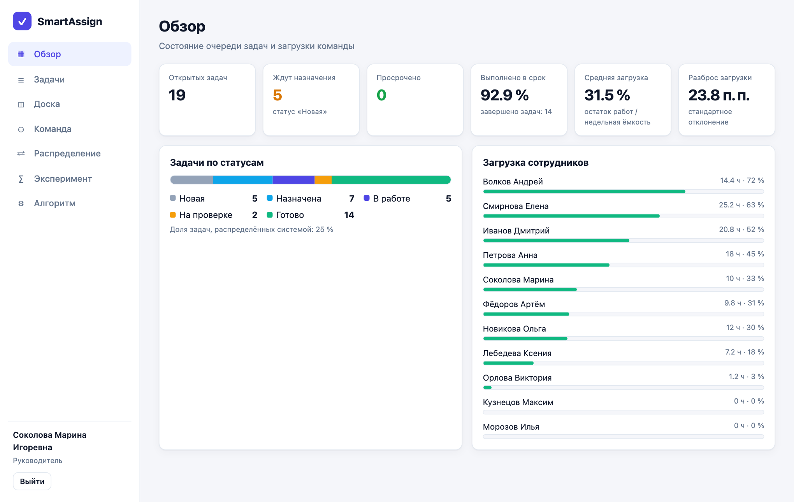
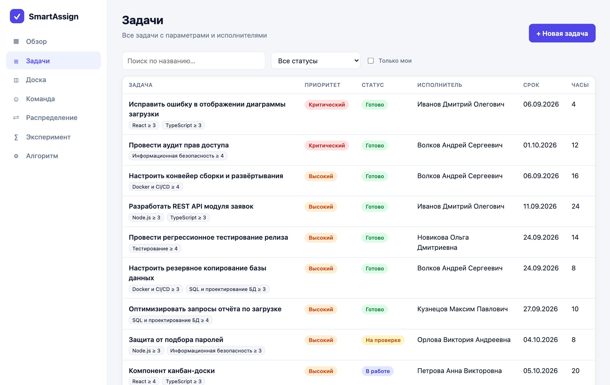
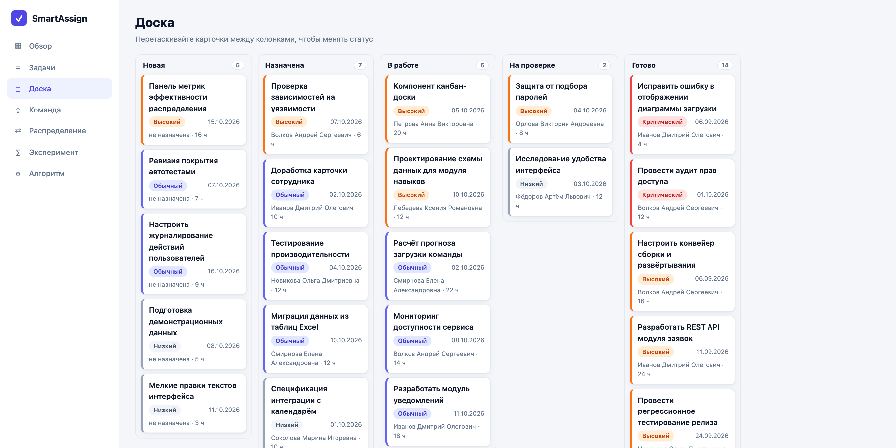
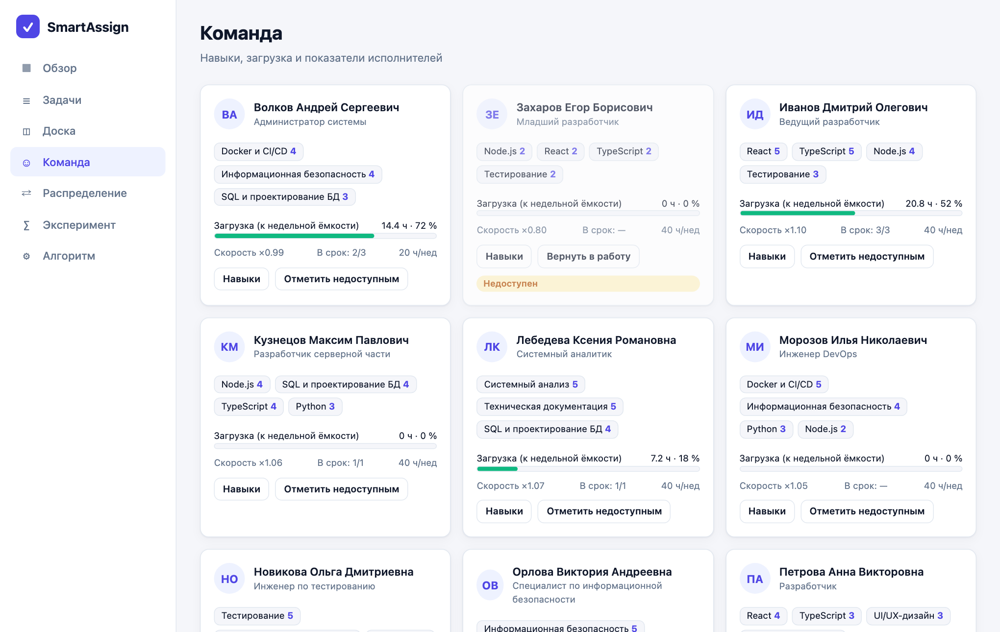
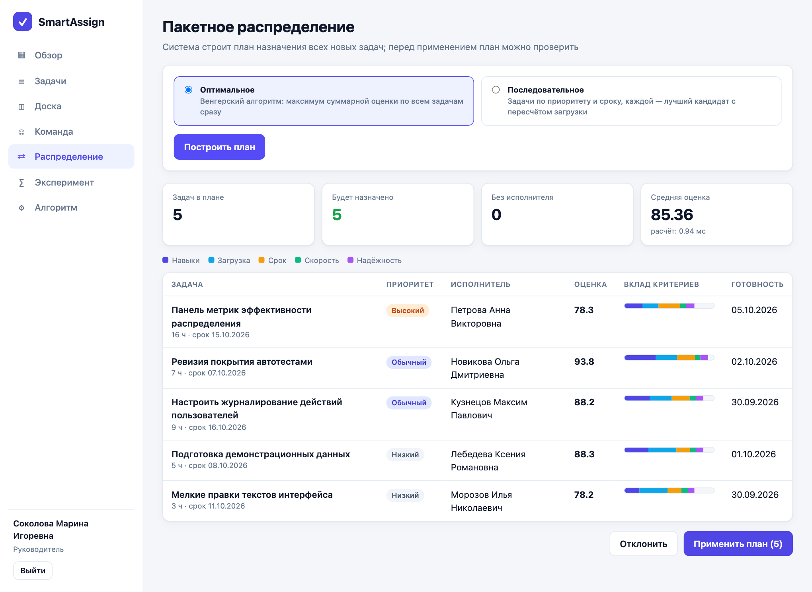

# SmartAssign

**Интеллектуальная информационная система распределения задач сотрудникам.**

Веб-приложение для руководителей групп и команд: оно подбирает для каждой задачи наиболее подходящего исполнителя,
объясняет свою рекомендацию и умеет строить оптимальный план назначений сразу для пакета задач.
Проект создан как практическая часть выпускной квалификационной работы (тема: «Разработка интеллектуальной
информационной системы распределения задач сотрудникам»).



## Содержание

- [Возможности](#возможности)
- [Как это работает](#как-это-работает)
- [Технологии](#технологии)
- [Быстрый старт](#быстрый-старт)
- [Режим разработки](#режим-разработки)
- [Демонстрационные учётные записи](#демонстрационные-учётные-записи)
- [Настройка через переменные окружения](#настройка-через-переменные-окружения)
- [Тесты и проверки](#тесты-и-проверки)
- [Структура проекта](#структура-проекта)
- [Программный интерфейс](#программный-интерфейс)
- [Скриншоты](#скриншоты)
- [Возможные проблемы](#возможные-проблемы)

## Возможности

- **Рекомендация исполнителя.** Для любой задачи система строит рейтинг сотрудников с оценкой от 0 до 100 и показывает,
  какой вклад внесли навыки, загрузка, срок, скорость и надёжность. Тех, кто не подходит, показывает серым с причиной.
- **Жёсткие ограничения.** Сотрудник без нужных навыков на требуемом уровне или помеченный недоступным (отпуск)
  никогда не попадает в рекомендации.
- **Прогноз срока.** Для каждого кандидата считается скорректированное время выполнения и ожидаемая дата готовности,
  с предупреждением о риске срыва срока.
- **Пакетное распределение.** План назначений для всех новых задач сразу: оптимальный (венгерский алгоритм) или
  последовательный (жадный). План можно посмотреть, отклонить или применить одним действием.
- **Самообучение.** После завершения задачи система обновляет скорость и надёжность исполнителя по фактическим
  трудозатратам и соблюдению срока.
- **Учёт задач.** Список с поиском и фильтрами, доска со статусами (перетаскивание карточек), история изменений.
- **Команда.** Профили сотрудников: навыки и уровни, недельная ёмкость, доступность, текущая загрузка.
- **Настройка алгоритма.** Веса критериев меняются ползунками; для срочных задач система сама усиливает вес срока
  и надёжности.
- **Эксперимент.** Встроенная имитация сравнивает алгоритмы с простыми правилами (случайно, по кругу, наименее
  загруженный, «лучший специалист») на синтетических данных.
- **Роли.** Администратор, руководитель и сотрудник с разным уровнем прав.
- **Интерфейс.** Русский язык, адаптивная вёрстка, светлая и тёмная темы (по настройке системы).

## Как это работает

1. **Ограничения:** сотрудник доступен и владеет всеми требуемыми навыками не ниже минимального уровня.
2. **Пять критериев** со значениями от 0 до 1: навыки, свободная загрузка, шанс уложиться в срок, скорость (по истории)
   и надёжность (доля задач в срок со сглаживанием).
3. **Взвешенная сумма** критериев даёт оценку 0–100. Веса задаёт руководитель; их корректирует приоритет задачи.
4. **Пакет задач** сводится к задаче о назначениях: каждый сотрудник представлен «слотами» с растущей стоимостью
   (нагрузка увеличивается с каждой новой задачей), решение находится венгерским алгоритмом.
5. **Обучение:** при завершении задачи скорость исполнителя обновляется экспоненциальным сглаживанием.

Код алгоритмов — в [`server/src/engine`](server/src/engine): это чистые функции без зависимости от базы данных и веб-каркаса,
поэтому их легко читать и тестировать.

## Технологии

| Часть | Что использовано |
|---|---|
| Язык | TypeScript (и на сервере, и на клиенте) |
| Сервер | Node.js 24, Fastify 5, Zod (проверка данных), JWT (аутентификация) |
| База данных | SQLite (встроенный модуль `node:sqlite`, отдельная СУБД не нужна) |
| Клиент | React 19, Vite, TanStack Query, React Router, собственные стили (CSS) |
| Тесты | встроенный запуск тестов Node.js (`node:test`) |

Нативных зависимостей и внешних сервисов нет: достаточно Node.js.

## Быстрый старт

**Требования:** [Node.js](https://nodejs.org/) версии **24 или выше** и npm. Проверить версию: `node -v`.
Если установлен [nvm](https://github.com/nvm-sh/nvm), достаточно выполнить `nvm use` в корне проекта.

```bash
# 1. Скачать проект
git clone <адрес-вашего-репозитория>
cd smartassign

# 2. Установить зависимости
npm install

# 3. Создать базу данных с демонстрационными данными
npm run seed

# 4. Собрать клиентскую часть
npm run build

# 5. Запустить
npm start
```

Откройте в браузере **http://localhost:3000** и войдите под одной из [демонстрационных учётных записей](#демонстрационные-учётные-записи).

> База данных создаётся автоматически при первом запуске, если её нет. Команда `npm run seed` пересоздаёт её
> с нуля (все данные будут заменены демонстрационными).

## Режим разработки

```bash
npm run dev
```

Запускает одновременно сервер (порт 3000, перезапуск при изменениях) и клиент (порт 5173, мгновенное обновление).
Откройте **http://localhost:5173** — запросы к `/api` проксируются на сервер.

## Демонстрационные учётные записи

Создаются командой `npm run seed`. Предназначены только для локального стенда.

| Роль | Почта | Пароль | Что может |
|---|---|---|---|
| Руководитель | `manager@smartassign.local` | `Manager#2025` | Задачи, назначения, пакетное распределение, веса, эксперимент |
| Сотрудник | `ivanov@smartassign.local` | `Employee#2025` | Просмотр, смена статуса своих задач |
| Администратор | `admin@smartassign.local` | `Admin#2025` | Всё, плюс создание учётных записей |

Остальные сотрудники (`petrova@`, `kuznetsov@`, `smirnova@` и др. с доменом `@smartassign.local`) входят с паролем
`Employee#2025`. На странице входа есть кнопки быстрого входа.

**Перед реальным использованием** смените пароли и задайте свой `JWT_SECRET`.

## Настройка через переменные окружения

Шаблон — файл [`.env.example`](.env.example).

| Переменная | По умолчанию | Назначение |
|---|---|---|
| `PORT` | `3000` | Порт сервера |
| `HOST` | `0.0.0.0` | Адрес, на котором слушает сервер |
| `DB_PATH` | `server/data/smartassign.db` | Файл базы данных SQLite |
| `JWT_SECRET` | `dev-secret-change-me` | Секрет подписи токенов. При `NODE_ENV=production` обязателен |
| `NODE_ENV` | — | `production` включает проверку `JWT_SECRET` |

Пример запуска с настройками:

```bash
NODE_ENV=production JWT_SECRET="длинная-случайная-строка" PORT=8080 npm start
```

## Тесты и проверки

```bash
npm test          # 23 автоматических теста: алгоритмы, API, права доступа
npm run typecheck # проверка типов сервера и клиента
npm run bench     # серия экспериментов: сравнение стратегий распределения
```

Тесты используют базу в памяти и фиксированную дату, поэтому не зависят от локальных данных.

## Структура проекта

```
smartassign/
├── server/                  Серверная часть
│   └── src/
│       ├── engine/          Интеллектуальное ядро
│       │   ├── scoring.ts     критерии, веса, оценка кандидатов
│       │   ├── hungarian.ts   венгерский алгоритм
│       │   ├── assign.ts      пакетное распределение
│       │   └── calendar.ts    рабочие дни
│       ├── app.ts           Маршруты API, роли, проверка запросов
│       ├── repo.ts          Доступ к данным, транзакции, самообучение
│       ├── db.ts            Схема SQLite
│       ├── simulate.ts      Имитационный эксперимент
│       ├── seed.ts          Демонстрационные данные
│       └── *.test.ts        Тесты
├── web/                     Клиентская часть (React + Vite)
│   └── src/
│       ├── pages/           Страницы: обзор, задачи, доска, команда, ...
│       ├── components/      Общие компоненты
│       └── index.css        Стили, светлая и тёмная темы
└── docs/screenshots/        Скриншоты для README
```

## Программный интерфейс

Все маршруты, кроме `POST /api/auth/login` и `GET /api/health`, требуют заголовок `Authorization: Bearer <токен>`.
Токен возвращает `POST /api/auth/login`.

| Метод | Маршрут | Назначение |
|---|---|---|
| POST | `/api/auth/login` | Вход, выдача токена |
| GET | `/api/me` | Текущий пользователь |
| GET, POST | `/api/skills` | Справочник навыков |
| GET, POST | `/api/employees` | Сотрудники (создание — администратор) |
| PATCH | `/api/employees/:id` | Навыки, ёмкость, доступность |
| GET, POST | `/api/tasks` | Список и создание задач |
| GET, PATCH, DELETE | `/api/tasks/:id` | Задача, изменение, удаление |
| POST | `/api/tasks/:id/status` | Смена статуса (при «готово» — обучение) |
| POST | `/api/tasks/:id/recommend` | Рейтинг кандидатов с разложением оценки |
| POST | `/api/tasks/:id/assign` | Ручное назначение |
| POST | `/api/tasks/:id/auto-assign` | Назначение лучшего кандидата |
| POST | `/api/assign/batch` | Пакетное распределение (`mode`: `optimal`/`greedy`, `apply`: `true`/`false`) |
| GET, PUT | `/api/settings/weights` | Веса критериев |
| GET | `/api/dashboard` | Сводные показатели |
| POST | `/api/simulation` | Имитационный эксперимент |
| GET | `/api/health` | Проверка работоспособности |

Пример:

```bash
TOKEN=$(curl -s localhost:3000/api/auth/login -H 'Content-Type: application/json' \
  -d '{"email":"manager@smartassign.local","password":"Manager#2025"}' | node -pe 'JSON.parse(require("fs").readFileSync(0)).token')
curl -s -X POST localhost:3000/api/tasks/1/recommend -H "Authorization: Bearer $TOKEN" -H 'Content-Type: application/json' -d '{}'
```

## Скриншоты

| | |
|---|---|
|  |  |
|  |  |
|  |  |

## Возможные проблемы

- **`npm start` пишет, что нет клиентской части, или страница пустая.** Выполните `npm run build`.
- **Ошибка про `node:sqlite` или неподдерживаемый синтаксис.** Нужен Node.js 24+. Проверьте `node -v`.
- **Порт 3000 занят.** Запустите с другим портом: `PORT=3001 npm start`.
- **Забыли пароль или сломали данные.** `npm run seed` пересоздаёт базу с демонстрационными данными.
- **Предупреждение об экспериментальном модуле SQLite.** Скрипты запускаются с флагом `--no-warnings`; для встроенного
  SQLite этого достаточно.

## Лицензия

Проект учебный. Укажите лицензию по своему усмотрению перед публикацией (например, MIT).
